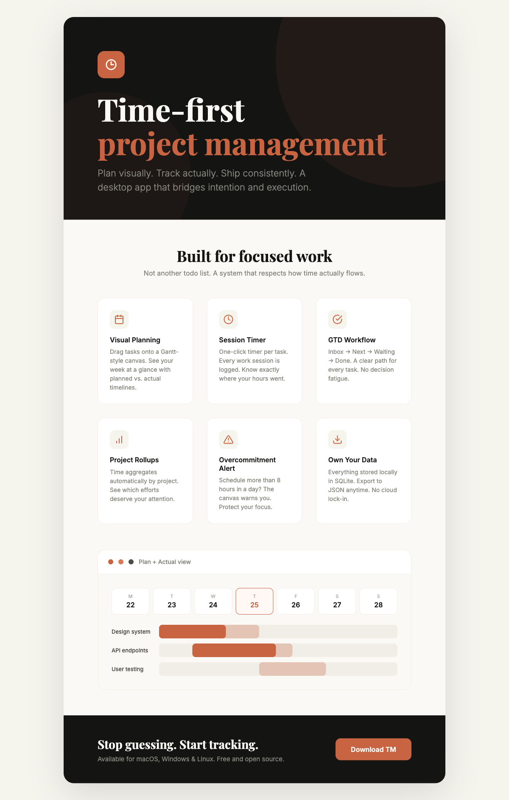

# TM

> Time-first project management. Plan visually. Track actually. Ship consistently.

TM is a desktop app that bridges intention and execution. It combines GTD-style task workflow with a Gantt-style planning canvas and automatic time tracking — so you know not just *what* you planned, but *what actually happened*.

## Download

| Platform | Download |
|----------|----------|
| macOS | [TM-0.1.0.dmg]() |
| Windows | [TM-0.1.0.exe]() |

Or clone the repo and build from source — see [CONTRIBUTING.md](CONTRIBUTING.md).

## Why TM?

Most task managers help you list work. TM helps you *feel* time.

- **Visual planning** — Drag tasks onto a timeline. See your week at a glance.
- **Plan vs. Actual** — Compare what you scheduled with what you actually did. Ghost bars show the gap.
- **Session timer** — One-click timer per task. Every work session is logged automatically.
- **Overcommitment alerts** — Schedule more than 8 hours in a day? The canvas warns you.
- **Tag rollups** — Time aggregates by tag. See where your hours really go.
- **Own your data** — Everything lives in a local SQLite database. Export to JSON anytime.

## Features

### GTD Workflow
Tasks flow through four statuses: **Inbox → Next → Waiting → Done**. Click the status dot to cycle. No decision fatigue, just a clear path forward.

### Canvas View
A Gantt-style timeline where you drag tasks to set planned start and end dates. Toggle between:
- **Plan** — see your scheduled work
- **Actual** — see what really happened, plus ghost blocks for planned-but-not-started tasks
- **Plan + Actual** — compare both side by side

### Per-Task Timer
Start a timer with one click. Stop it when you're done. The app logs every session with start time, end time, and duration. Total time accumulates across multiple sessions.

When the timer stops, `actual_start` and `actual_end` are automatically populated from the session timestamps. `actual_start` becomes read-only once set.

### Overcommitment Detection
When planned duration exceeds 8 hours on any day, the day header shows a warning. Protect your focus before the week spirals.

### Tag Organization
Group tasks by a major tag. Each tag shows total hours worked across all its tasks. The default "Other" tag catches anything uncategorized. Secondary tags provide extra filtering flexibility.

### Actual Date Guardrails
Actual dates cannot be set to future dates — enforced in both the UI and the data layer. This keeps your tracked time grounded in reality.

## Supported Languages

English, 简体中文, Français, Español, Deutsch, 日本語, Русский

## Roadmap

- [x] GTD task workflow
- [x] Visual canvas with Plan/Actual/Both modes
- [x] Drag-to-resize on canvas
- [x] Per-task timer with session log
- [x] Tag time rollups
- [x] Overcommitment warnings
- [x] First-time onboarding
- [x] Ghost blocks for planned-but-not-started tasks
- [x] Actual date future-date prevention
- [x] Timer auto-populates actual dates
- [ ] Recurring tasks
- [ ] Dependency chains
- [ ] Data import

## License

MIT
